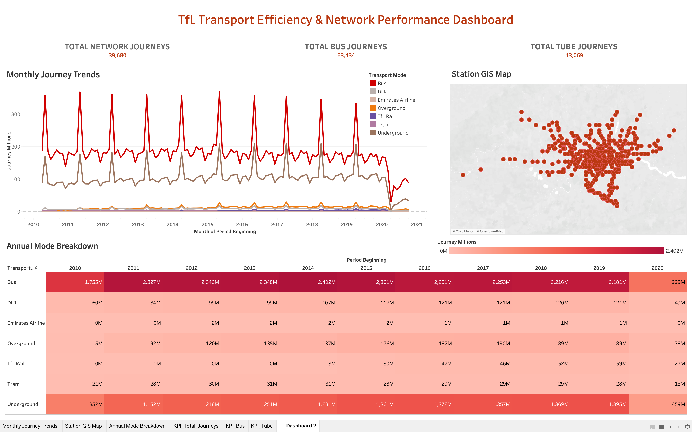

# 🚇 TfL Transport Efficiency & Network Performance Analysis

An end-to-end data analytics project transforming raw **Transport for London (TfL)** multi-modal passenger datasets into interactive spatial dashboards and time-series performance metrics.

---

## 📊 Live Interactive Dashboard

🔗 **[Click Here to View Live Tableau Dashboard](https://public.tableau.com/views/TfLTransportEfficiencyNetworkPerformanceAnalysis/Dashboard2?:language=en-GB&:sid=&:redirect=auth&:display_count=n&:origin=viz_share_link)**

---

### 💡 Key Features at a Glance

| Feature | Description |
| :--- | :--- |
| 📊 **Executive KPI Cards** | Real-time views of total volume, bus share, and tube share styled with TfL brand guidelines |
| 📈 **Trend Analysis** | Continuous line series mapping post-pandemic recovery and seasonal peak volumes |
| 🗺️ **Station GIS Mapping** | Interactive spatial plot mapping **470+ stations** across London transit zones |
| 🔄 **Annual Mode Grid** | Heatmap visualizing YoY passenger shifts across all modes (Tube, Bus, DLR, Overground) |

---

## 🛠️ Architecture & Tech Stack
|📁 Raw TfL Data (.csv / .xlsx)
|🐬 MySQL Workbench -
Analytical Data Cleaning & Pipeline
Stored Views (vw_tfl_journeys_by_mode, vw_tfl_annual_growth)
|📊 Tableau Public-
Interactive Visualizations & Spatial Mapping

---

- **Database Engine:** MySQL Workbench (SQL Scripts & Views)
- **Data Layers:** Raw TfL period datasets, GIS metadata, station zonal maps
- **Visualization:** Tableau Public

---

## 📂 Repository Structure

Text

|📁 SQL\
01_data_ingestion.sql       # Schema setup & data loading\
02_analytical_views.sql     # Optimised views for Tableau integration

|📁 Data\
raw_tfl_periods.csv         # Multi-modal passenger volume dataset\
station_gis_metadata.xlsx   # Spatial station coordinates & zones

|🖼️ dashboard_preview.png       # Preview thumbnail for README

|📄 README.md                   # Project documentation
